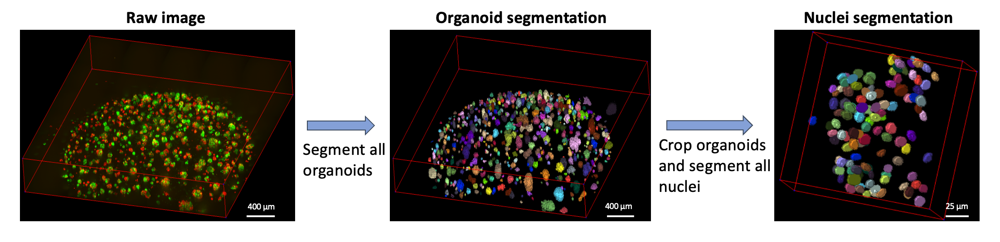

# ***Cellos***: High-throughput deconvolution of 3D organoid dynamics at cellular resolution for cancer pharmacology 

<p>
    
</p>

- [Overview](#overview)
- [Data description](#data-description)
- [Installing the pipeline](#installing-the-pipeline)
- [Running the pipeline](#running-the-pipeline)

## Overview 

***Cellos*** (Cell and Organoid Segmentation) is a pipeline developed to perform high-throughput volumetric 3D segmentation and morphological quantification of organoids and their cells. ***Cellos*** segments organoids using classical algorithms and segments nuclei using our trained model based on Stardist-3D (https://github.com/stardist/stardist). 

## Data description
The image data used here were exported from the *PerkinElmer* Opera Phenix high content screening confocal microscope. The resulting folder contains subfolders with tiff files (Images) and xml files (metadata). Each tiff file was a single image from one well, one field, one plane and one channel. We developed an automatic protocol that organized all tiff files from same well and saved them as zarr arrays to minimize RAM and storage. All information for the images are deconvoluted from the respective metadata files. 

## Installing the pipeline

We provide two ways to install the pipeline:
1. Install into a Python 3.7 environment using `conda` or `pip`
2. Build and use a Docker or Apptainer/Singularity container

### Install into a Python 3.7 environment

Currently, the pipeline uses a Python 3.7 environment. We provide a defined `requirements.txt` to install all packages and dependencies for a working environment on Rocky 9 Linux.  
We recommend creating a virtual environment for running the pipeline, for example using [`conda`](https://conda-forge.org/download/).
 
Installing the pipeline using `conda` to manage the Python version:  

```bash
git clone https://github.com/TheJacksonLaboratory/Cellos.git
cd Cellos #(make sure you are in the correct directory)
conda create -f environment.yml
```

This will use `conda` to create a Python 3.7 environment and then install all packages from PyPI using `pip` and the `requirements.txt` file.

If you prefer to install the pipeline dependencies into a pre-existing Python 3.7 environment (e.g. `venv`), you can use:

```bash
pip install --require-hashes --no-deps -r requirements.txt
```
This will ensure you install the exact packages that we've tested.

> [!NOTE]
> - At present we've tested the pipeline only on Centos 7 and Rocky 9 Linux and using Python 3.7.
> - The provided environment does not include additional packages required for specific GPU support, e.g. CUDA.

### Build and use a Docker or Apptainer/Singularity container

We provide a `Dockerfile` and an Apptainer `.def` file (`Cellos.def`) to build a Docker or Apptainer/Singularity container.

To build a Docker container, you can use the provided `Dockerfile` after cloning the repository:

```bash
docker build -t cellos .
```

To build an Apptainer/Singularity container, you can use the provided `.def` file (either clone the repository or wget/curl the `.def` file):

```bash
apptainer build cellos.sif Cellos.def
```

#### Building the Apptaier/Singularity container on Sumner2

> [!TIP]
> At JAX, the easiest way to build containers from the definitions in this repository is to use the `build` partition on Sumner2.
> For more details regarding accessing and using this JAX-specific resource, please see [the instructions in SharePoint](https://jacksonlaboratory.sharepoint.com/sites/ResearchIT/SitePages/JAX-HPC-Pro-Tip.aspx).

You can access it from a login node by using:  
```bash
sinteractive -p build -q build
```
Load the needed sigularity/apptainer module (note that `singularity` can be used interchangeably with the new name `apptainer`):
```
module load singularity
```

To build the container either clone the repository:
```
git clone https://github.com/TheJacksonLaboratory/Cellos.git
```
or download the container definition and the Python requirements.txt (lock)file:
```
wget https://github.com/TheJacksonLaboratory/Cellos/raw/refs/heads/master/Cellos.def
```

Eitherway, using the build partition, ensure you are in the directory with the definition and requirements.txt file and then you can build the container using [`singularity build`](https://apptainer.org/docs/user/1.1/build_a_container.html) :

```
singularity build cellos.sif Cellos.def
```
> [!NOTE]
> This will take a few minutes! It will download an image, install packages, build the python environment, and then write the resultant .sif file.

Once you see `INFO:    Build complete: cellos.sif` you can end the session using `exit`.

> [!TIP]
> You can now add this container to your `PATH` variable to ensure you can use it from other (sub)directories. Ensure you are in the same directory as the `cellos.sif` file and run:
> ```
> export PATH=$PATH:$(pwd)
> ```

## Running the pipeline

There are two main steps to run the pipeline: 
1. Organanizing images and organoids segmentation. 
2. Nuclei segmentation

Each of these can be run on an individual well using a plain `bash` script or as an `sbatch` script. To run on a whole plate, the script uses `sbatch` to launch jobs on a SLURM HPC cluster. The `sbatch` settings have been optimized using the sample data set and the JAX Sumner2 cluster.

> [!IMPORTANT]
> If you are running this pipeline on Sumner2, be aware that the scheduler is merciless and will kill your job if it exceeds the requested memory.  
> The two `sbatch` scripts, `scripts/process_organoids/stitch_well.sh` and `scripts/process_cells/cells_seg_well.sh`, have ~25% memory headroom, based on the sample data, but if your jobs are killed you will want to edit them to increase the requested memory.

### The process for running organizing images and organoids segmentation steps

> [!IMPORTANT]
> If you are using a virtual environment, ensure you have it activated!  
> For example, using `conda` as recommended, do:
> ```bash
> conda activate organoid
> ```
> Otherwise, provide the path to your Python 3.7 interpreter in the `PYTHONPATH` variable.  
> If you are using the containerized Python interpreter, set the `PYTHONPATH` to the path of the container.  
> You may also need to ensure the scripts are executable using:
> ```bash
> chmod u+x <script name>
> ```

- For a single well--this takes ~2 hours wall-time and uses ~128G of memory.  
  From an interactive session, using `bash`:
    ```bash
    cd scripts/process_organoids/
    PYTHONPATH=$(which python) bash stitch_well.sh -r <row number> -c <column number> -f ../../config.example.cfg
    ```
  As a SLURM job using `sbatch` (requests: 2 cores, 160G memory):
    ```bash
    cd scripts/process_organoids/
    PYTHONPATH=$(which python) sbatch stitch_well.sh -r <row number> -c <column number> -f ../../config.example.cfg
    ```

- For a whole plate--this submits a series of the above as SLURM jobs using `sbatch`:
    ```bash
    cd scripts/process_organoids/
    PYTHONPATH=$(which python) bash process_plate.sh -f ../../config.example.cfg 
    ```

### The process for running nuclei segmentation steps: 

- For a single well--this takes <20 min wall-time with 8 cores and uses ~6G of memory.  
  From an interactive session, using `bash`:
    ```bash
    cd scripts/process_cells/
    PYTHONPATH=$(which python) bash cells_seg_well.sh -r <row number> -c <column number> -f ../../config.example.cfg
    ```
  As a SLURM job using `sbatch` (requests: 8 cores, 10G of memory):
    ```bash
    cd scripts/process_cells/
    PYTHONPATH=$(which python) sbatch cells_seg_well.sh -r <row number> -c <column number> -f ../../config.example.cfg
    ```

  For a whole plate--this submits a series of the above as SLURM jobs using `sbatch`:    
    ```bash
    PYTHONPATH=$(which python) bash cells_process_plate.sh -f ../../config.example.cfg
    ```

> [!NOTE]
> All of the above commands are using `../../config.example.cfg` as the location of the config file, because of the layout of this repository. You can provide an **absolute path** to another location.

### The configuration file

The pipeline requires certain key parameters to be provided. For this we use a simple INI style plain-text file that can be parsed with the [`configparser` module](https://docs.python.org/3/library/configparser.html).  
In the repository we provide an example configuration file, `config.example.cfg`. 

| Parameter | Description | 
|-----|-------------|
| `[pipeline]` | |
| plate_path   | path to where your raw images are | 
| output_path   | path to where the csv files and zarr arrays will be saved   | 
| well_targets   | name number of rows and columns (row1,col1&#124;row2,col2) of wells to analyze   | 
| `[stitch_well]` | |
| plane_size   |  size of image of one field, one z-slice and one channel   | 
| overlap_x  | overlapping pixels between two adjacent fields   |
overlap_y   | overlapping pixels between two adjacent fields   | 
| `[cells_seg_well]` | |
| output_path   | path to where the csv files will be saved   | 
| stardist_path   | path to the trained model for nuclei segmentation  | 


> [!NOTE]
> The paths can be *relative* to the scripts, as is in the example provided here, which assumes the layout of the repository is fixed. Otherwise, the paths should be provided as **absolute paths**.

## Usage

We have made an example dataset with one well data publicly available. The well row number=3 and column number=7. The image has 3 channels, channel1=EGFP, channel2=mCherry and channel3=brightfield. 

It can be downloaded from: https://figshare.com/articles/dataset/cellos_data_zip/21992234  

On Linux, you can download it as follows:

```bash
wget https://figshare.com/ndownloader/files/39032216
```

> [!WARNING]
> This is a ~11Gb zip file. 

On Linux, it needs to be unziped using [7z](https://www.7-zip.org):

```bash
7z x 39032216
```

This will extract a `cellos_data` folder consisting of images (`.tiff`) and `Index.idx.xml` (metadata) file.

To use the provided `config.example.cfg` and script commands from above, we recommend you place the `cellos_data` in the root of this repository.

You should obtain the following layout for the `Cellos` directory, where `...` indicates abridged files:

```
├── config.example.cfg
├ ...
├── cellos_data
│   └── Index.idx.xml
|   └── r03c07 ... .tiff
├── models
│   └── stardist
│       ├ ...
├── output
│   ├ ...
└── scripts
    ├── process_cells
    │   ├── cells_process_plate.sh
    │   ├── cells_seg_well.py
    │   └── cells_seg_well.sh
    └── process_organoids
        ├── process_plate.sh
        ├── stitch_well.py
        └── stitch_well.sh
```

> [!IMPORTANT]
> We provide the expected results for running the pipeline on the sample data in the `output` folder in the root of the repository.
> If you plan on running the pipeline on the sample data, we recommend you backup or rename this folder such that you can compare your results with ours.
> Alternately, you can change the `output_path` paramters in the `.cfg` file.

Assuming the above layout, you can use the provided `config.example.cfg` and run the pipeline in two steps:

> [!IMPORTANT]
> - If you are using an interactive session, ensure you have enough memory!
> - Ensure you have activated your virtual environment, e.g:
> ```bash
> conda activate organoid
> ```

1. Organize images and segment organoids (this takes ~2 hours using the `sbatch` script)  
  From the Cellos directory (root of the repository) `cd` into the proper scripts directory:

    ```bash
    cd scripts/process_organoids
    ```
    
    Run the first step using `bash` (an interactive session):
    
    ```bash
    PYTHONPATH=$(which python) bash stitch_well.sh -r 3 -c 7 -f ../../config.example.cfg
    ```
  
    Alternately, run the first step as a SLURM job using `sbatch` (requests: 2 cores, 160G memory):
  
    ```bash
    PYTHONPATH=$(which python) sbatch stitch_well.sh -r 3 -c 7 -f ../../config.example.cfg
    ```
    
2. Segment cells (this takes <20 min using the `sbatch` script)  
  From the Cellos directory (root of the repository) `cd` into the proper scripts directory:

    ```bash
    cd scripts/process_cells
    ```

    Run the second step using `bash` (an interactive session): 
  
    ```bash
    PYTHONPATH=$(which python) bash cells_seg_well.sh -r 3 -c 7 -f ../../config.example.cfg
    ```
  
    Alternately, run the second step as a SLURM job using `sbatch` (requests: 8 cores, 10G of memory):
  
    ```bash
    PYTHONPATH=$(which python) sbatch cells_seg_well.sh -r 3 -c 7 -f ../../config.example.cfg
    ```
