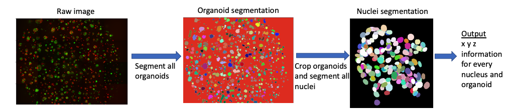

# ***Cellos***: High-throughput deconvolution of 3D organoid dynamics at cellular resolution for cancer pharmacology 

    

- [Overview](#overview)
- [Data description](#data-description)
- [Installing the pipeline](#installing-the-pipeline)
- [Running the pipeline](#running-the-pipeline)

## Overview 

***Cellos*** (Cell and Organoid Segmentation) is a pipeline developed to perform high-throughput volumetric 3D segmentation and morphological quantification of organoids and their cells. ***Cellos*** segments organoids using classical algorithms and segments nuclei using our trained Stardist-3D (https://github.com/stardist/stardist) model. 

## Data description
The image data used here were exported from the Opera Phenix high content screening confocal microscope. The resulting folder contains subfolders with tiff files (Images) and xml files (metadata). Each tiff file was a single image from one well, one field, one x,y-plane and one channel. We developed an automatic protocol that organized all tiff files from same well and saved them as zarr arrays to minimize RAM and storage. All information about the images are deconvoluted from metadata file. 

## Installing the pipeline
The pipeline uses conda environment, make sure you have anaconda (https://www.anaconda.com/products/distribution) before installing and running the pipeline. 
 
+ The steps for installing the pipeline:  

	  git clone https://github.com/TheJacksonLaboratory/ChuangLab_organoids_analysis.git
      cd ChuangLab_organoids_analysis #(make sure you are in the correct directory)
	  conda create -n organoid python=3.7.6
      conda activate organoid
      pip install -r requirements.txt

## Running the pipeline
There are two main steps to run the pipeline: 1. Organanizing images and organoids segmentation. 2. Nuclei segmentation

+ The process for running organizing images and organoids segmentation steps: 

      cd scripts/process_organoids/
      PYTHONPATH=~/anaconda3.1/envs/organoid/bin/python bash stitch_well.sh -r (add row number here) -c (add column number here) -f ../../config.example.cfg (when you want to process one well)
	  PYTHONPATH=~/anaconda3.1/envs/organoid/bin/python bash process_plate.sh -f ../../config.example.cfg (when you want to run multiple wells at the same time)

+ The process for running organizing images and organoids segmentation steps: 

      cd scripts/process_cells/
      PYTHONPATH=~/anaconda3.1/envs/organoid/bin/python bash cells_seg_well.sh -r (add row number here) -c (add column number here) -f ../../config.example.cfg (when you want to process one well)
	  PYTHONPATH=~/anaconda3.1/envs/organoid/bin/python bash cells_process_plate.sh -f ../../config.example.cfg (when you want to run multiple wells at the same time)

> *Note*: you have to edit the config file to your needs. 
>
> |Parameter |Description | 
> |----------|-------------|
> | plate_path   | path to where your raw images are | 
> | output_path   | path to where the csv files and zarr arrays will be saved   | 
> | well_targets   | rows and columns of wells to analyze  | 
> | plane_size   |  size of image of one field, one z-slice and one channel   | 
> | overlap_x and y   | overlapping pixels between two adjacent fields   | 
> | stardist_path   | path to the trained model for nuclei segmentation  | 
> | ...  | ...  | 

> ***Tip***: All of the steps implemented in our pipeline are optimized to run on high-performance computer (HPC) systems to take advantage of parallel processing and to carry out the steps that computationally intensive. The most expensive step in the pipeline is to process the whole image in the steps to organize the image and segment organoids. To minimize this, if not needed, you can remove the step to calculate area of image that has organoids and to plot raw images. 

